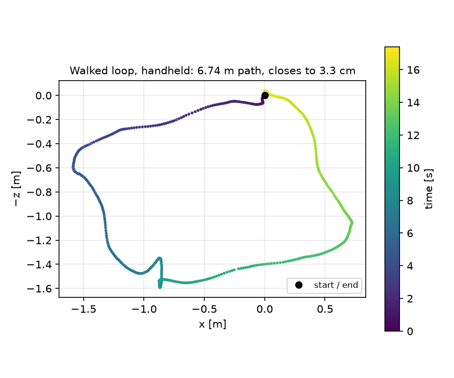

# PoseCam

**Turn any ARCore-capable Android phone into a data recorder for robot learning.**

PoseCam records synchronized RGB frames, 6-DoF camera poses and raw IMU data at 30 fps,
entirely on the phone. Mount it on a handheld gripper, record a demonstration, and export
video + per-frame poses in the format used by [AnySense](https://github.com/NYU-robot-learning/AnySense)-style
imitation-learning pipelines. No iPhone, depth sensor or external tracking needed.

<p align="center">
  
</p>

*A handheld walk around a 2 × 1.5 m rectangle: the recorded path is 6.74 m (tape
measure: 7.0 m) and returns to within 3.3 cm of its start, 0.5% of the distance walked.*

## Highlights

- **Every frame accounted for.** One row per camera frame, including untracked frames
  and images dropped under load. Frame *N* in the CSV is frame *N* on disk, so indices
  never silently shift.
- **One clock for everything.** Camera frames, poses and IMU samples share the sensor
  clock (`frame.timestamp` / `event.timestamp`); wall-clock time is never mixed in.
- **Raw data, processed offline.** Poses come straight from `Camera.getPose()` with no
  smoothing or re-basing. ARCore relocalization jumps are detected and logged in the
  session manifest, then handled at export time instead of being hidden on the device.
- **Never blocks the camera.** JPEG encoding runs on a bounded background queue, and
  when it overflows the frame is dropped and recorded as dropped. Holds 30.0 fps
  indefinitely at 640×480, with 0 dropped images in a 5-minute recording.
- **Device-independent.** No hardcoded camera configs. Validated on a Samsung Galaxy
  S20 FE and a Tecno Pova 5G, with per-phone intrinsics, camera↔IMU axes and clock
  checks recorded in each session.
- **Export on the phone or the desktop.** The app and `tools/export_anysense.py`
  implement the same export policy and were checked to produce byte-identical pose files
  across 37 recordings (52,996 pose lines).

## How it works

```
ARCore session (GL thread) ──► pose + timestamp ──► poses.csv
        │
        └─► CPU image (YUV) ──► bounded queue ──► JPEG encoder ──► frames/
                                     └─ full? drop + log reason

SensorManager ──► accelerometer + uncalibrated gyro (~420 Hz) ──► imu.csv
Camera2 metadata ──► exposure, focus, OIS, rolling shutter ──► frame_metadata.csv
```

A recording is a plain folder of CSV, JSON and JPEG files. A set of Python tools
validates it (timing, sync, IMU alignment, camera calibration) and converts it to MP4 +
pose-text demos. Long tracking gaps and pose jumps split a recording into separate clean
demos, and gaps of up to 5 frames are interpolated.

## Build and install

Requires the Android SDK and an [ARCore-supported phone](https://developers.google.com/ar/devices)
with USB debugging enabled.

```bash
./gradlew assembleDebug testDebugUnitTest
adb install -r app/build/outputs/apk/debug/app-debug.apk
```

Release builds (`./gradlew assembleRelease`) read signing settings from a
`keystore.properties` file that is not in the repository.

Built with Kotlin, ARCore 1.56, Android Gradle Plugin 9.4; `minSdk` 24.

## Record

1. Open PoseCam and allow camera access.
2. Move the phone slowly until the status bar says **Ready to record**
   (3 s of continuous tracking with no pose jumps).
3. **Record**, perform the demonstration, **Stop**.

The **Recordings** screen lists sessions and can export the demo format, share a zip,
save to `Downloads/PoseCam/`, or delete. See [docs/SETUP_GUIDE.md](docs/SETUP_GUIDE.md)
for setting up a new phone and [docs/RECORDING_TIPS.md](docs/RECORDING_TIPS.md) for a
one-page guide to recording good demonstrations.

## Analyze and export

The tools run with [uv](https://docs.astral.sh/uv/), which installs their dependencies
automatically.

```bash
tools/pull_captures.sh                                # copy sessions from the phone into ./data/
uv run tools/check_sync.py data/capture-…             # timing, pose/image/IMU consistency
uv run tools/plot_trajectory.py data/capture-…        # summary + trajectory plot
uv run tools/overlay_check.py data/capture-…          # world-fixed axes drawn onto the frames
uv run tools/check_imu_alignment.py data/capture-…    # camera↔IMU axes and time offset
uv run tools/calibrate_camera.py data/capture-… --pattern 9x6 --square 0.025
uv run tools/export_anysense.py data/capture-…        # MP4 + pose-text demos
uv run tools/check_export.py exports/<demo>           # check an exported demo before use
```

### Export format

```
exports/2026-09-17-14_58_35/
├── RGB_2026-09-17-14_58_35.mp4       H.264, 30 fps
├── AR_Pose_2026-09-17-14_58_35.txt   one line per video frame: "<epoch_ms>" ,qx,qy,qz,qw,tx,ty,tz
└── posecam_export.json               provenance
```

Pose line *N* belongs to video frame *N*. Poses use the OpenGL camera convention
(−Z forward, +Y up), the same as ARKit. `--rotate` sets the video orientation for the
way the phone is mounted, and `--size 720x960` matches AnySense's video size.

## Recording format (`posecam-5`)

```
capture-20260916T213140-9c433c/
├── frames/             000000_<timestamp_ns>.jpg, ...  (sensor-native orientation)
├── poses.csv           frame_index,timestamp_ns,tx,ty,tz,qx,qy,qz,qw,tracking_state,image
├── frame_metadata.csv  exposure, ISO, focus distance, OIS mode, rolling shutter skew per frame
├── imu.csv             timestamp_ns,sensor,x,y,z,bias_x,bias_y,bias_z
├── intrinsics.json     fx, fy, cx, cy, width, height
├── device.json         phone model, Camera2 characteristics, IMU sensors
└── manifest.json       session info, versions, camera config, stats, detected pose jumps
```

- Untracked frames keep their row, with empty pose fields and the tracking state.
- `image` is `saved` or `dropped:<reason>` (`queue_full`, `not_yet_available`,
  `deadline_exceeded`, `resources_exhausted`).
- IMU axes are the phone's sensor frame, not the camera's.
  [docs/COORDINATES.md](docs/COORDINATES.md) documents every frame convention, the
  measured camera↔IMU mapping and the timestamp semantics.

## Measured performance

| | Samsung Galaxy S20 FE | Tecno Pova 5G |
|---|---|---|
| Frame rate (640×480) | 29.9–30.0 fps | 29.9 fps |
| Dropped images | 0 in a 5-min recording | 0 in four 2.5–5.3 min recordings |
| Storage (JPEG q75) | ~3.4 GB/h | ~3.4–3.9 GB/h |
| IMU rate | ~419 Hz | ~422 Hz |

Scale was checked against a tape measure on the S20 FE: measured distances were within
~4% of the real ones.

## License

[MIT](LICENSE)
