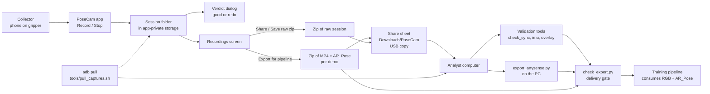
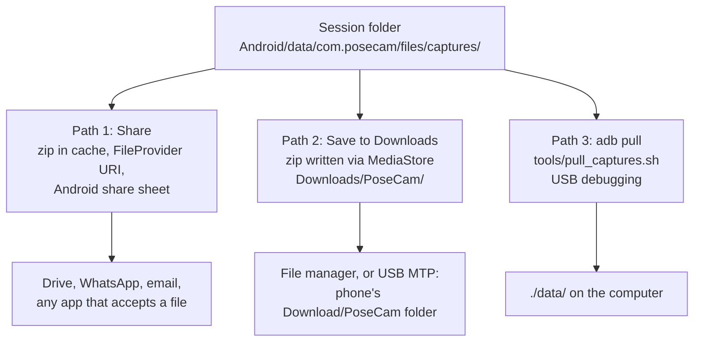
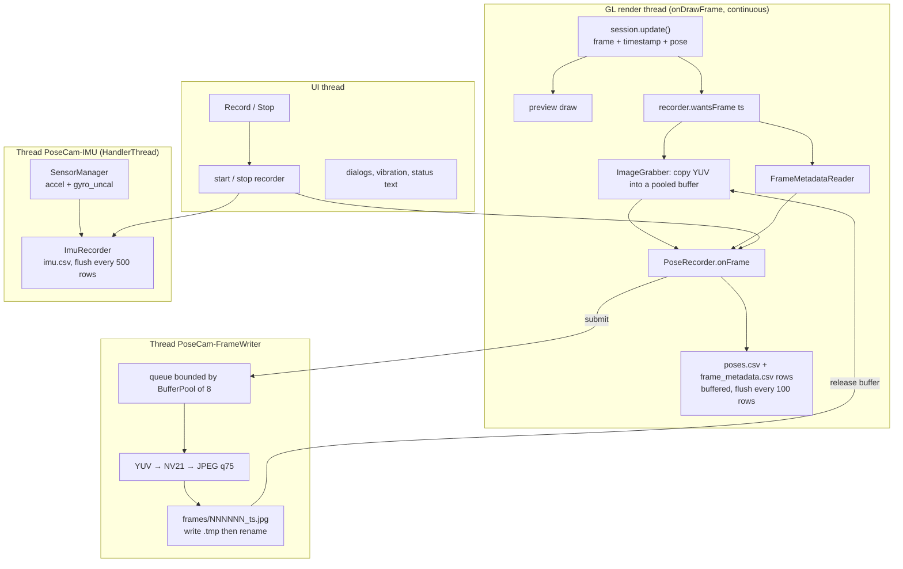
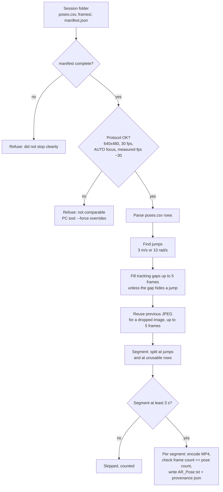

# PoseCam: End-to-End Implementation Guide

This is the complete reference for how PoseCam works, from the moment a collector opens
the app to the moment a demo folder reaches the training pipeline. It describes the code
as it is, not as it was planned.

> **Scope.** Written against branch `main` at commit `3aef719` (app `0.3.0`, recording
> format `posecam-5`). Two side branches exist and are summarised in
> [§15](#15-other-branches). Every number quoted here is either a constant in the source
> (with the file named) or a measurement quoted from the repository's own docs (marked
> *reported*).

---

## Contents

1. [What PoseCam is](#1-what-posecam-is)
2. [The whole workflow at a glance](#2-the-whole-workflow-at-a-glance)
3. [How data leaves the phone ("uploading")](#3-how-data-leaves-the-phone-uploading)
4. [Repository map](#4-repository-map)
5. [Build, install, permissions](#5-build-install-permissions)
6. [App architecture](#6-app-architecture)
7. [Recording workflow in detail](#7-recording-workflow-in-detail)
8. [On-disk format `posecam-5`](#8-on-disk-format-posecam-5)
9. [The Recordings screen](#9-the-recordings-screen)
10. [The export engine](#10-the-export-engine)
11. [Desktop tooling](#11-desktop-tooling)
12. [Operating procedures by role](#12-operating-procedures-by-role)
13. [Every threshold and constant](#13-every-threshold-and-constant)
14. [Testing](#14-testing)
15. [Other branches](#15-other-branches)
16. [Known discrepancies and gotchas](#16-known-discrepancies-and-gotchas)
17. [Troubleshooting](#17-troubleshooting)
18. [Glossary](#18-glossary)

---

## 1. What PoseCam is

PoseCam is an Android app (Kotlin, ARCore) that turns any ARCore-certified phone into a
**data recorder for robot learning**. A collector mounts the phone on a handheld gripper,
performs one demonstration, and PoseCam writes:

- **RGB frames** at 30 fps, 640×480, as JPEGs,
- a **6-DoF camera pose** for every frame, straight from ARCore's `Camera.getPose()`,
- **raw IMU data** (accelerometer + gyroscope, about 420 Hz),
- **per-frame camera metadata** (exposure, ISO, focus, optical stabilisation),
- JSON files describing the phone, the camera intrinsics and the session.

Everything is stored on the phone, in plain files. By default nothing is sent anywhere. An optional, build-time
cloud upload to S3 exists (off unless a backend URL is built in): see [CLOUD_UPLOAD.md](CLOUD_UPLOAD.md).

The data is then converted (on the phone or on a computer) into the format the
downstream training pipeline reads, which is modelled on NYU's
[AnySense](https://github.com/NYU-robot-learning/AnySense) iPhone app: for each
demonstration one folder holding an H.264 MP4 and a text file with one pose per video
frame.

### Design principles (they explain most of the code)

| Principle | What it means in code |
|---|---|
| **Raw on the device, process offline** | Poses are never smoothed or re-based in the app. ARCore jumps are *detected and logged*, not hidden. |
| **Every frame accounted for** | One `poses.csv` row per camera frame, even untracked or image-less ones, so frame *N* in the CSV is always frame *N* on disk. |
| **One clock** | Frames, poses and IMU samples all use the sensor clock (`Frame.getTimestamp()`, `SensorEvent.timestamp`). Wall-clock time is metadata only. |
| **Never block the camera** | JPEG encoding runs on its own thread behind a fixed pool of 8 buffers. If the pool is empty the frame's image is dropped *and the drop is recorded*. |
| **One protocol for the whole team** | 640×480, 30 fps, autofocus. Anything else is flagged red in the UI and refused by the export. |
| **Don't make the collector watch the screen** | The phone is on a gripper pointing away. Problems are signalled by vibration and an end-of-take verdict. |

---

## 2. The whole workflow at a glance



In words:

1. **Set up (once per phone).** Install the APK, grant camera permission, install
   *Google Play Services for AR* if asked. An analyst runs the one-time checks in
   [§12.2](#122-analyst-new-phone-model-one-time) for every new phone *model*.
2. **Record (every demo).** Open the app, move the phone until the status bar says
   **Ready to record** (3 s of stable tracking), press **Record**, perform one
   demonstration, press **Stop**, read the verdict.
3. **Export (every demo or batch).** In **Recordings**, tap a recording and choose
   **Export for pipeline (MP4)**. The app splits it at tracking problems and writes one
   folder per clean stretch.
4. **Move the data (the "upload").** Share the zip through Android's share sheet, save it
   to `Downloads/PoseCam/` and copy over USB, or pull it with `adb`.
   See [§3](#3-how-data-leaves-the-phone-uploading).
5. **Validate.** The analyst runs the Python tools on the data. `check_export.py` is the
   last gate before delivery.
6. **Deliver.** The `RGB_<stem>.mp4` + `AR_Pose_<stem>.txt` folders go to whoever runs the
   training pipeline.

---

## 3. How data leaves the phone ("uploading")

> **Update (branch `feature/cloud-upload`).** An optional cloud upload now exists, disabled unless a backend URL is built
> in; see [CLOUD_UPLOAD.md](CLOUD_UPLOAD.md). The rest of this section describes the default build and the manual hand-off,
> which are unchanged.

**The default PoseCam build has no upload feature.** There is no server, no cloud sync and no network use:

- On `main` the manifest requests only `CAMERA`, `HIGH_SAMPLING_RATE_SENSORS` and `VIBRATE`: **no `INTERNET`
  permission**. (The cloud-upload branch adds `INTERNET`, `ACCESS_NETWORK_STATE`, foreground-service and notification
  permissions.)
- A search of every Kotlin, XML, Gradle and Python file for `http`, `okhttp`, `socket`,
  `upload`, `firebase` and similar finds nothing.
- [PLAN.md](PLAN.md) states the scope outright: *"RGB + pose + intrinsics + IMU. No depth,
  no meshing, no viewer, no upload."*

Getting data off the phone is therefore a **manual hand-off**, and there are three ways to
do it:



| | Path 1: **Share** | Path 2: **Save to Downloads** | Path 3: **adb pull** |
|---|---|---|---|
| Needs a computer | No | For the USB copy only | Yes, with `adb` |
| Needs USB debugging | No | No | **Yes** |
| What you get | One `.zip` handed to another app | `Downloads/PoseCam/<name>.zip` | The raw session folders, unzipped |
| Works on Android | 7.0+ | **10+ only** (menu item hidden below) | 7.0+ |
| Can carry the exported MP4 demos | Yes | Yes | No: exports are generated in the app cache, not in `captures/` |
| Code | `SessionsActivity.shareZip` | `SessionsActivity.saveZipToDownloads` | [tools/pull_captures.sh](../tools/pull_captures.sh) |

**What to send.** The small thing is the **export** (`Export for pipeline (MP4)`): about
45 MB per 2.5 minutes *(reported)*. The **raw recording** is about five times bigger and is
only needed for diagnostics, calibration or re-export. Keep the raw recording on the phone
until whoever processes the data confirms the export arrived.

Each path is explained step by step in [§9](#9-the-recordings-screen).

---

## 4. Repository map

```
PoseCam/
├── app/                                  Android application (module ":app")
│   ├── build.gradle.kts                  SDK levels, version, release signing
│   └── src/
│       ├── main/
│       │   ├── AndroidManifest.xml       permissions, activities, FileProvider
│       │   ├── kotlin/com/posecam/       25 source files, listed in §6.3
│       │   └── res/
│       │       ├── layout/activity_capture.xml   camera view + status bar + buttons
│       │       ├── layout/activity_sessions.xml  recordings list
│       │       ├── values/strings.xml            button labels, "no recordings" text
│       │       ├── xml/file_paths.xml            FileProvider: cache/shared/ only
│       │       └── mipmap-*/, values/ic_launcher_background.xml   launcher icon
│       └── test/kotlin/com/posecam/      15 JUnit test classes
├── tools/                                desktop tooling (Python run by `uv`, plus one shell script)
├── docs/
│   ├── IMPLEMENTATION_README.md          this file
│   ├── COORDINATES.md                    every coordinate/timestamp convention, measured camera↔IMU mapping
│   ├── SETUP_GUIDE.md                    onboarding a phone, one-time per-phone checks
│   ├── RECORDING_TIPS.md                 one-page handout for collectors
│   ├── PLAN.md                           original build plan (historical; parts superseded)
│   └── images/walked-loop.png            trajectory figure used in the README
├── README.md                             public project summary
├── LICENSE                               MIT
├── build.gradle.kts, settings.gradle.kts, gradle.properties, gradle/    Gradle build
└── .gitignore                            keeps data/, exports/, dist/, keystores, CLAUDE.md out of git
```

Folders that exist locally but are **not in git** (see [.gitignore](../.gitignore)):
`data/` (sessions pulled from phones), `exports/` (PC-made demos), `dist/` (shareable
APKs), `keystore.properties` and `keys/` (release signing), `local.properties` (SDK path).

---

## 5. Build, install, permissions

### 5.1 Toolchain

| Item | Value | Source |
|---|---|---|
| Language | Kotlin, Java 17 bytecode | `app/build.gradle.kts` |
| Android Gradle Plugin | 9.4.0 | `gradle/libs.versions.toml` |
| Gradle | 9.7.1 | `gradle/wrapper/gradle-wrapper.properties` |
| ARCore SDK | `com.google.ar:core` 1.56.0 | `gradle/libs.versions.toml` |
| AndroidX | `androidx.core` 1.17.0 (only for `FileProvider`) | same |
| Tests | JUnit 4.13.2 | same |
| `minSdk` / `targetSdk` / `compileSdk` | 24 / 37 / 37 | `app/build.gradle.kts` |
| App id, version | `com.posecam`, `0.3.0` (versionCode 4) | same |
| UI toolkit | Plain `android.app.Activity` + XML layouts (no Compose, no AppCompat) | |

`minSdk 24` is ARCore's own minimum: any phone that can run ARCore can run PoseCam.
The app declares `android.hardware.camera.ar` as **required**, so Google Play and the
installer treat non-ARCore phones as incompatible.

### 5.2 Commands

```bash
./gradlew assembleDebug testDebugUnitTest                        # build + run unit tests
adb install -r app/build/outputs/apk/debug/app-debug.apk         # install on a USB-debugging phone
./gradlew assembleRelease                                        # release build (see signing)
```

**Release signing.** `app/build.gradle.kts` reads `keystore.properties` from the repo root
(`storeFile`, `storePassword`, `keyAlias`, `keyPassword`). If the file is missing,
`assembleRelease` still builds, but the APK is **unsigned and uninstallable**. Release
builds enable v1, v2 and v3 signatures (v1 because Android 7–8 sideloads verify it).
**R8 minification is deliberately off**: ARCore and the Camera2 metadata paths use
reflection, "and a field tool is not worth a silent stripping bug."

**Upgrading across signing keys.** `0.3.0` is signed with a different key from `0.2.x`, so
Android refuses to install it over the old app. The old app must be uninstalled first, and
**uninstalling deletes every recording still inside the app**. Export or save them first
([SETUP_GUIDE §2](SETUP_GUIDE.md)).

### 5.3 Permissions and manifest

| Declaration | Why |
|---|---|
| `CAMERA` (runtime prompt) | ARCore needs the camera. |
| `HIGH_SAMPLING_RATE_SENSORS` (install-time) | Without it Android 12+ caps `SENSOR_DELAY_FASTEST` at 200 Hz. |
| `VIBRATE` | Alerts for a phone nobody is looking at. |
| `uses-feature camera.ar required` | ARCore-only app. `<meta-data com.google.ar.core = required>`. |
| `uses-feature glEsVersion 0x00020000` | OpenGL ES 2.0 for the preview. |
| `<queries>` for `com.google.ar.core` | Android 11+ package visibility, so the app can read the installed ARCore version for `manifest.json`. |
| `allowBackup="false"` | Recordings are never auto-backed-up. |
| **No `INTERNET`, no storage permissions** | Storage is the app's own external-files folder; Downloads is written through `MediaStore`. |

Activities: `CaptureActivity` (launcher; portrait-locked; `configChanges` so rotation never
recreates it and kills the AR session mid-recording) and `SessionsActivity` (not exported).
A `FileProvider` (authority `${applicationId}.fileprovider`) exposes only `cache/shared/`.

### 5.4 Saved settings

`SharedPreferences` file `posecam`:

| Key | Meaning | Default |
|---|---|---|
| `cpu_image_width` / `cpu_image_height` | Chosen camera image size | 640 × 480 |
| `autofocus` | `true` = `Config.FocusMode.AUTO`, `false` = `FIXED` | `true` |
| `export_rotation_degrees` | Last rotation chosen in the export dialog | 0 |

---

## 6. App architecture

### 6.1 Screens

| Screen | File | Job |
|---|---|---|
| **Capture** (launcher) | [CaptureActivity.kt](../app/src/main/kotlin/com/posecam/CaptureActivity.kt) | ARCore session, live preview, tracking gate, Record/Stop, alerts, end-of-take verdict. Also the OpenGL renderer. |
| **Recordings** | [SessionsActivity.kt](../app/src/main/kotlin/com/posecam/SessionsActivity.kt) | List sessions; export, share, save to Downloads, delete. |

The Capture screen is a full-screen `GLSurfaceView` (the camera feed) with a translucent
status bar at the top and, at the bottom, a settings row (**resolution** button, **focus**
button, **Recordings** button) above the big **Record** button.

### 6.2 Threads and data flow



Key points:

- **GL thread**: runs `session.update()` in `onDrawFrame` as fast as the renderer spins.
  `updateMode` is `LATEST_CAMERA_IMAGE` (non-blocking), so the renderer can run faster than
  the camera. `PoseRecorder.wantsFrame()` ignores any frame whose timestamp is not strictly
  newer than the last one recorded.
- **Disk writes for CSV rows** happen on the GL thread but go into 64 KB buffers and are
  flushed every 100 rows, so they cost almost nothing. **JPEG encoding never happens on the
  GL thread.**
- **`BufferPool`** (8 `YuvBuffer`s) is the *only* bound on the image queue. A buffer goes
  out at `ImageGrabber.grab()` and comes back when `FrameWriter` finishes (or fails). No
  free buffer means the frame is dropped as `queue_full`.
- **`PoseRecorder`** guards all state with one lock. The lock is **released while waiting
  for the writer thread to drain** at Stop, so the GL thread never waits on JPEG encoding.
- **IMU** listeners stay registered the whole time the screen is active, so the sensors are
  warm when Record is pressed.

### 6.3 File-by-file reference

All files are in `app/src/main/kotlin/com/posecam/`.

**Capture and recording**

| File | Responsibility |
|---|---|
| `CaptureActivity.kt` | Lifecycle, camera permission, ARCore install flow, session creation and configuration, the whole per-frame loop, Record/Stop, vibration alerts, free-space check, settings buttons, verdict and failure dialogs. |
| `PoseRecorder.kt` | Owns one session folder. Writes `poses.csv`, `frame_metadata.csv`, `device.json`, `intrinsics.json`, `manifest.json`; tracks counts, gaps, drops, jumps; creates session ids. Thread-safe. |
| `PoseCsv.kt` | Row format for `poses.csv` (header, tracked row, untracked row, `image` column values). |
| `FrameMetadata.kt` | `FrameMetadata` (one frame's Camera2 results), its CSV row, and `FrameMetadataSummary` (running stats for the manifest). |
| `FrameMetadataReader.kt` | Reads `Frame.imageMetadata` fields; any missing field becomes `null`. |
| `Intrinsics.kt` | `Intrinsics` data class and `IntrinsicsTracker` (samples ≈1/s, detects change, builds `intrinsics.json`). |
| `PoseJumpDetector.kt` | Flags a jump between consecutive tracked frames: >3 m/s or >10 rad/s. Records up to 100. |
| `TrackingGate.kt` | Arms the Record button after 3 s of continuous, jump-free tracking. |
| `TakeVerdict.kt` | Pure logic that turns a finished take's stats into "looks good" / "record again" plus reasons. |
| `CameraConfigs.kt` | Chooses the ARCore camera config explicitly (back camera, 30 fps, no depth sensor, size nearest 640×480); describes it for the manifest. |
| `DeviceInfo.kt` | Builds `device.json`: build info, Camera2 characteristics, IMU sensor specs. |

**Image pipeline**

| File | Responsibility |
|---|---|
| `ImageGrabber.kt` | `ImageGrabber`: on the GL thread, copy the ARCore CPU image into a pooled buffer and close the image immediately. `JpegEncoder`: on the writer thread, YUV → NV21 → JPEG with `YuvImage.compressToJpeg`. |
| `FrameImage.kt` | Sealed type: `Captured(buffer)` or `Dropped(reason)`; the four drop reasons. |
| `BufferPool.kt` | Fixed-size pool of `YuvBuffer`; `tryAcquire()` returns `null` when empty. |
| `YuvBuffer.kt` | Reusable copy of a `YUV_420_888` image; converts strided planes to NV21. |
| `FrameWriter.kt` | Single-thread JPEG writer; temp-file-then-rename; timestamp-mismatch stats; returns buffers to the pool; `finish()` waits ≤60 s. |
| `BackgroundRenderer.kt` | Draws the camera feed as a full-screen quad with an OES texture. Preview only; nothing here is recorded. |

**IMU**

| File | Responsibility |
|---|---|
| `ImuSource.kt` | Registers accelerometer and *uncalibrated* gyroscope (falls back to calibrated gyro) at `SENSOR_DELAY_FASTEST` on a dedicated thread; describes sensors for `device.json`. |
| `ImuRecorder.kt` | Writes `imu.csv`; keeps a 1 s pre-roll while idle; reports per-sensor rates for the manifest. |

**Export and sharing**

| File | Responsibility |
|---|---|
| `SessionsActivity.kt` | The Recordings screen and all its actions. |
| `PipelineExporter.kt` | Orchestrates a phone-side export: protocol check, segments, per-segment MP4 + pose file + provenance. |
| `SessionExport.kt` | Pure logic (no Android APIs): parse `poses.csv`, find jumps, interpolate short gaps, reuse images, segment, name, and format pose lines. Mirrors `tools/export_anysense.py`. |
| `Mp4Writer.kt` | JPEG list → H.264 MP4 with `MediaCodec` + `MediaMuxer`; rotation applied to pixels. |
| `SessionZipper.kt` | Zips a folder (JPEG/MP4 entries stored, not recompressed). |
| `Json.kt` | Tiny JSON writer so metadata code is unit-testable off-device. |

---

## 7. Recording workflow in detail

### 7.1 Launch (`onCreate`)

1. Inflate `activity_capture`, set `FLAG_KEEP_SCREEN_ON` (a screen timeout would pause
   ARCore and end the take).
2. Resolve the recordings root: `getExternalFilesDir(null)/captures`. If external storage is
   unavailable, show a fatal message.
3. Build the `PoseRecorder` (JPEG quality 75) with its `BufferPool`, the `ImageGrabber`, and
   the `ImuSource`/`ImuRecorder`.
4. Configure the `GLSurfaceView` (GLES 2, RGBA8888 + 16-bit depth, `preserveEGLContextOnPause`,
   continuous rendering).
5. If ARCore reports `UNSUPPORTED_DEVICE_NOT_CAPABLE`, show *"This device does not support
   ARCore."* and disable recording.

### 7.2 Resume (`onResume`) and session creation

1. **Camera permission.** If missing, request it once (a flag prevents a second request
   cancelling the first). If the user ticked "don't ask again", the app opens the system
   settings page for PoseCam and shows *"PoseCam needs camera permission to record."*
2. **`createSession()`**, only if there is no session yet:
   - `ArCoreApk.requestInstall`. If the install flow was launched, return and try again on
     the next resume. Errors map to messages: install Google Play Services for AR / update
     it / update PoseCam / device not compatible.
   - Create the `Session`, log every supported camera config to logcat.
   - **Choose the camera config** (`CameraConfigs.select`): back camera, 30 fps target,
     depth sensor not used (falling back to any back-camera config if that filter is empty);
     of the candidates, take the CPU image size whose **pixel count is closest to the saved
     size** (default 640×480).
   - **Configure ARCore**: focus mode from the saved preference; `LATEST_CAMERA_IMAGE`;
     plane finding, light estimation, depth, instant placement and cloud anchors all
     **disabled** ("nothing below is needed for camera pose; disabling saves CPU and heat").
   - Build the manifest metadata and `device.json` content up front.
3. `session.resume()`. On `CameraNotAvailableException`, show *"Camera not available. Close
   other camera apps and reopen PoseCam."*
4. Resume the GL surface and the IMU listeners; **reset the tracking gate and the idle jump
   detector** (ARCore re-settles after any pause, so the 3 s must be re-earned).

### 7.3 Pause (`onPause`)

Backgrounding or locking the screen **ends the take cleanly**: stop the GL thread first (so
no frame arrives mid-stop), pause the session, call `stopRecording()` (which finalises the
files and shows the verdict), then unregister the IMU.

### 7.4 The tracking gate

`TrackingGate` returns "armed" only after `TRACKING` has been continuous, with no pose jump,
for **3 s** measured in frame timestamps. Any non-tracking frame or jump resets the timer.
Why: ARCore keeps re-scaling its pose for the first seconds of a session (a Tecno Pova 5G
take showed seven 13–55 cm jumps in its first 1.4 s), so a bare `TRACKING` state is not
enough. The Record button is enabled only while armed (or already recording). The status
bar text follows the state:

| State | Status text |
|---|---|
| Not tracking | `Move the phone slowly to start tracking…` |
| Tracking, gate not yet armed | `Stabilizing, keep moving slowly…` |
| Armed | `Ready to record · N min of space left` |
| Recording | `● REC 12.3 s · 369 frames · 30.0 fps [· N dropped] [· N jump(s)]`, red background if tracking is lost |

While idle, a separate `PoseJumpDetector` ("idle jump detector") feeds the gate so a
relocalization during settling also resets it.

### 7.5 Pressing Record

`toggleRecording()` when not recording:

1. **Free-space check.** Below **4 GB** free, refuse with a dialog ("Only X GB free, about Y
   minutes of recording. Export and delete old recordings first.").
2. Capture `pressedNs = SystemClock.elapsedRealtimeNanos()` (the Record-tap time on the
   sensor clock), reset live counters.
3. `PoseRecorder.start(...)` (creates the session folder, writes `device.json`, opens
   `poses.csv` and `frame_metadata.csv` with their headers, and **immediately writes an
   initial `manifest.json` with `"complete": false`**, so even a crash leaves a
   self-describing folder).
4. `ImuRecorder.start(dir)`: opens `imu.csv` and **first writes the last second of idle
   samples** (the pre-roll). Camera frames reach the app about 100 ms after exposure, so the
   first recorded frame predates the tap; the pre-roll makes the IMU cover it.
5. Button text becomes **Stop**.

Session ids look like `capture-20260916T143052-a3f9c1`: local time for humans plus a random
24-bit hex suffix. The timestamps *inside* the files are authoritative.

### 7.6 The per-frame loop

`CaptureActivity.onDrawFrame`, in order, for every render:

1. Clear; bail out if there is no session.
2. If the session changed, bind the camera texture to it. If the viewport changed, call
   `setDisplayGeometry`.
3. `frame = session.update()`. Any `Throwable` is logged, and **if recording it ends the
   take through `onWriteFailure`** instead of crashing.
4. Draw the preview. If `frame.timestamp == 0` (no image yet), stop here.
5. Build the tracking label (`TRACKING`, `STOPPED`, or `PAUSED:<TrackingFailureReason>`).
6. **If `recorder.wantsFrame(timestamp)`** (recording *and* a strictly newer timestamp):
   1. On the first frame, compute `firstFrameAgeNs = elapsedRealtimeNanos − timestamp` (clock
      sanity check).
   2. About once a second (every 30 frames) read `camera.imageIntrinsics` and pass it on.
   3. `ImageGrabber.grab(frame)`: take a pooled buffer, `acquireCameraImage().use {…}` to
      copy the YUV planes into it, and close the image at once.
   4. `FrameMetadataReader.read(frame)`: exposure, frame duration, rolling-shutter skew, ISO,
      focus distance, focal length, OIS mode.
   5. If `TRACKING`, take `camera.pose` (the **physical sensor pose**, never the
      display-oriented one) and call `recorder.onFrame` with translation and quaternion;
      otherwise call it with `null` pose and the state label.
7. Log tracking-state changes to logcat.
8. **While recording:** vibrate on the *transition* from tracking to not tracking; vibrate
   when the jump count increases.
9. Re-arm the gate if a reset was requested; feed the idle jump detector.
10. While recording: update the live fps (3 s window); if `recorder.writeFailure` is set,
    end the take cleanly on the UI thread.
11. Update the gate; **every 200 ms** refresh the status text, button enablement and colours
    on the UI thread.

### 7.7 What `PoseRecorder.onFrame` does (under the lock)

1. If not recording, or the timestamp is not newer than the last one, release any captured
   buffer back to the pool and return.
2. **Image outcome.** `Captured` → hand the buffer to `FrameWriter.submit(frameIndex, ts,
   buffer)` and set the row's `image` column to `saved`. `Dropped(reason)` → count it per
   reason and write `dropped:<reason>`.
3. **Pose row.** Tracked: count it, close any open tracking gap (keeping the longest), run the
   jump detector, write all 11 columns. Untracked: open a gap if none, tell the jump detector
   continuity broke, write the row with empty pose fields and the state.
4. Write the matching `frame_metadata.csv` row. An `IOException` here sets `writeFailure` and
   returns, with no crash.
5. Update first/last timestamps and the frame counter; flush both CSVs every 100 rows.

### 7.8 The image pipeline and the four drop reasons

| `image` column | Meaning |
|---|---|
| `saved` | A JPEG was queued for this frame (`frames/<index>_<timestamp_ns>.jpg`). |
| `dropped:queue_full` | All 8 pool buffers were busy; the encoder could not keep up (heat, storage, high resolution). |
| `dropped:not_yet_available` | ARCore had no CPU image for this frame (`NotYetAvailableException`). |
| `dropped:deadline_exceeded` | ARCore timed out (`DeadlineExceededException`). |
| `dropped:resources_exhausted` | ARCore's image pool was exhausted (`ResourceExhaustedException`). |

The writer thread names the JPEG after the **frame** timestamp, writes it as `<name>.tmp`
and renames it on success, so a half-written JPEG is never mistaken for a frame. It also
records `(image timestamp − frame timestamp)`; a difference over **16 ms** (about half a
frame) is counted as a mismatch ("probably a different frame"). Measured: ~1 ms on a Galaxy
S20 FE, up to ~8 ms on a Tecno Pova 5G *(reported)*.

If a JPEG **fails to encode**, its index goes into `images.write_failures` in the manifest,
but its `poses.csv` row still says `saved` (see [§16](#16-known-discrepancies-and-gotchas)).

### 7.9 The IMU pipeline

`ImuSource` registers the accelerometer and `TYPE_GYROSCOPE_UNCALIBRATED` (calibrated gyro
only if the phone has no uncalibrated one) at `SENSOR_DELAY_FASTEST` on a `HandlerThread`.
Each event goes to `ImuRecorder` with `SensorEvent.timestamp` **as is** (no reordering, no
de-duplication). While idle, samples are kept in a rolling 1 s deque; while recording they are
written to `imu.csv`. Uncalibrated gyro rows carry 6 values (`x,y,z` raw rate plus
`bias_x,bias_y,bias_z`); accelerometer rows leave the bias columns empty. Typical measured
rate is ~420 Hz *(reported)*.

### 7.10 Alerts (nobody is watching the screen)

| Event | Vibration | Pattern (ms) |
|---|---|---|
| Tracking lost mid-take | **One long buzz** | `0, 400` |
| Pose jump detected mid-take | **Three short buzzes** | `0, 120, 100, 120, 100, 120` |
| Finished take should be redone, or a write failed | **Two medium buzzes** | `0, 250, 150, 250` |

The status bar also turns **red** while recording without tracking, and the resolution and
focus buttons turn red when they differ from the team protocol.

### 7.11 Stop and finalise

`stopRecording()` (UI thread):

1. `ImuRecorder.stop()` closes `imu.csv` and returns per-sensor `samples`, first/last
   timestamps, mean rate.
2. Build the extra manifest fields: `imu` stats and `clock_check`
   (`elapsed_realtime_minus_first_frame_timestamp_ns`,
   `elapsed_realtime_minus_last_imu_timestamp_ns`). If camera and IMU share a clock, both are
   small and positive (processing latency).
3. `PoseRecorder.stop(extra)`:
   - Under the lock: close the CSV writers, detach the `FrameWriter`.
   - **Outside the lock:** `frames.finish()` waits up to **60 s** for queued JPEGs.
   - Under the lock again: write the final `intrinsics.json` (`complete: true`) and the final
     `manifest.json` (`complete: true`, stop time, image stats), and return a `Summary`.
4. `onRecordingStopped` computes the **verdict**, vibrates if it says redo, and shows a dialog.

### 7.12 The verdict

`TakeVerdict.of(seconds, frames, trackedFrames, poseJumps, longestGapSeconds, imagesDropped)`:

| Condition | Effect |
|---|---|
| Any pose jump | **Redo**: "Tracking jumped N times: the take is split there, so parts of it are lost." |
| Longest tracking gap > 5/30 s (≈0.167 s) | **Redo**: "Lost tracking for X s: the take is split there." |
| Shorter than 5 s | **Redo**: "Only X s long." |
| Some untracked frames, all in short gaps | Reported, **not** a redo ("short enough to be filled in"). |
| Some dropped images | Reported, **not** a redo. |
| None of the above | **"Take looks good"** |

The thresholds are chosen to match what the exporter does: short gaps (≤5 frames) and a few
missing images are repaired; jumps and longer gaps split a take, and a short take may not
survive that. The dialog also shows `<s> s, <n> frames, <p>% tracked` and `Saved as <folder>`.

### 7.13 Failure handling and crash safety

| Failure | Behaviour |
|---|---|
| App killed or crashes mid-take | `manifest.json` already exists with `complete: false`. CSVs lose at most the last ≤100 rows; `imu.csv` at most ≤500. The Recordings list shows `INCOMPLETE`; export refuses it. |
| Disk full / `IOException` writing CSVs | `PoseRecorder.writeFailure` is set; the GL loop sees it, vibrates "redo", stops cleanly and shows *"Recording stopped: could not write… What was recorded up to that point is saved."* |
| `session.update()` throws while recording | Same clean stop. |
| IMU write fails | IMU writing stops quietly; the pose loop reports the failure. |
| JPEG encode fails | Frame index recorded in `images.write_failures`; buffer still returned to the pool; temp file deleted. |
| Pool exhausted | Frame's image dropped (`queue_full`), recorded, never blocks. |
| ARCore camera unavailable | Friendly message; session discarded and recreated next resume. |
| Screen lock / app switch | `onPause` stops the take cleanly. |

### 7.14 Locked settings: resolution and focus

The team records **640×480, 30 fps, autofocus**. The two buttons on the Capture screen can
change resolution (cycling through sizes the camera offers) and focus (auto/fixed), but:

- both ask for confirmation, and both turn **red** whenever they differ from the protocol,
- neither can be changed while recording,
- a recording made with any other setting is **refused by the export** (see
  [§10.1](#101-protocol-check)), because it cannot be mixed with the rest of the dataset.

Fixed focus freezes the lens "at roughly 1 m", blurring other distances; autofocus can shift
intrinsics slightly, which `intrinsics.json` and `frame_metadata.csv` record so it is visible
offline.

---

## 8. On-disk format `posecam-5`

A recording is a plain folder under `Android/data/com.posecam/files/captures/` (private to the
app; on Android 11+ file managers cannot browse it, which is why the Recordings screen exists).

```
capture-20260916T213140-9c433c/
├── frames/             000000_<timestamp_ns>.jpg, 000001_…   sensor-native orientation, JPEG q75
├── poses.csv           one row per camera frame
├── frame_metadata.csv  one row per poses.csv row
├── imu.csv             accelerometer + gyroscope samples
├── intrinsics.json     fx, fy, cx, cy for the CPU image
├── device.json         phone, Camera2 characteristics, IMU sensors
└── manifest.json       everything about the session
```

### 8.1 `poses.csv`

```
frame_index,timestamp_ns,tx,ty,tz,qx,qy,qz,qw,tracking_state,image      (values below are illustrative)
0,296906159688983,0.0123,-0.004,0.0511,0.01,0.7,0.0,0.71,TRACKING,saved
1,296906193470983,,,,,,,,PAUSED:INSUFFICIENT_FEATURES,saved
```

- **One row per distinct camera frame**, tracked or not. `frame_index` is `0…N-1`;
  `timestamp_ns` is strictly increasing.
- Pose = `T_world_camera` from `Camera.getPose()`: translation in metres, unit quaternion
  scalar-last. Untracked rows leave the 7 pose fields empty.
- `tracking_state`: `TRACKING`, `STOPPED`, or `PAUSED:<reason>`.
- `image`: `saved` or `dropped:<reason>` ([§7.8](#78-the-image-pipeline-and-the-four-drop-reasons)).

### 8.2 `frame_metadata.csv`

```
frame_index,timestamp_ns,exposure_time_ns,frame_duration_ns,rolling_shutter_skew_ns,sensitivity_iso,focus_distance_diopters,focal_length_mm,ois_mode
```

From ARCore's `Frame.getImageMetadata()`. Any field a phone does not report is left empty.
`focus_distance_diopters` is 1/m (0 = infinity) and is only metric when
`device.json → camera.focus_distance_calibration` is `APPROXIMATE` or `CALIBRATED` (on an
`UNCALIBRATED` phone the values are in arbitrary units and can even be negative). `ois_mode` 1 means
optical stabilisation was on, which invalidates fixed intrinsics.

### 8.3 `imu.csv`

```
timestamp_ns,sensor,x,y,z,bias_x,bias_y,bias_z
296905179564081,accel,0.058950003,0.528,9.85305,,,
296905179564081,gyro_uncal,-5.5E-4,8.25E-4,8.25E-4,0.0,0.0,0.0
```

Sensors are `accel` (m/s², includes gravity), `gyro_uncal` (rad/s, raw, with the platform's
drift estimate in `bias_*`: subtract it for the calibrated rate) and `gyro` (calibrated, only
on phones without an uncalibrated gyro). Axes are the **phone's sensor frame**, not the
camera's.

### 8.4 `intrinsics.json`

Pinhole `width, height, fx, fy, cx, cy` (pixels, for the CPU image), plus `model`,
`distortion` ("none reported by ARCore"), `source`, `complete`, `samples`,
`changed_during_recording`, `distinct_values`, `first_change_frame_index`, `at_end`. It is
written at the first sample, rewritten when the value changes, and finalised at Stop.
**Measured on an S20 FE:** ARCore's `fx` reads about 3% low and the image has mild radial
distortion of up to ~5 px ([COORDINATES.md](COORDINATES.md)).

### 8.5 `device.json`

`manufacturer, brand, model, device, hardware, android_release, android_sdk,
build_fingerprint`, then `camera` (Camera2 id, `timestamp_source` REALTIME/UNKNOWN,
stabilisation modes, focal lengths, focus calibration and distances, sensor size and pixel
array, `sensor_orientation_deg`, factory `lens_intrinsic_calibration`, `lens_pose_*`, and on
API 28+ `lens_distortion` and `lens_pose_reference`) and `imu` (name, vendor, version, units,
resolution, range, min/max delay of each sensor).

### 8.6 `manifest.json`

| Group | Fields |
|---|---|
| Identity | `format_version` (`posecam-5`), `session_id`, `start_wall_time_utc`, `stop_wall_time_utc`, **`complete`** |
| Counts | `frame_count`, `tracked_frame_count`, `longest_tracking_gap_s`, `first_timestamp_ns`, `last_timestamp_ns`, `measured_fps` |
| Sync | `record_pressed_elapsed_realtime_ns` (tap time on the sensor clock), `clock_check`, `timestamp_source` |
| Images | `images`: `directory`, `filename_pattern`, `format`, `jpeg_quality`, `orientation`, `queued`, `written`, `dropped` (by reason), `write_failures`, `first_write_error`, `image_frame_timestamp_mismatches_over_half_frame`, `image_minus_frame_timestamp_ns_range` |
| Camera | `capture_metadata` (OIS modes seen, frames with OIS on, focus and exposure ranges), `camera_config` (`camera_id`, `cpu_image_size`, `gpu_texture_size`, `fps_range`, `depth_sensor_usage`), `focus_mode`, `intrinsics_changed_during_recording` |
| Tracking | `pose_jumps`: `count`, thresholds, and a list of `{frame_index, timestamp_ns, translation_m, rotation_deg, interval_s}` |
| Provenance | `app_version`, `arcore_version`, `device`, `pose_source` (`Camera.getPose`), `write_failure` |
| IMU | `imu`: per sensor `samples`, `first_timestamp_ns`, `last_timestamp_ns`, `mean_rate_hz` |

### 8.7 Coordinates and clocks (summary of [COORDINATES.md](COORDINATES.md))

- **World frame:** +Y up (gravity), −Z is the horizontal direction the camera faced when the
  **ARCore session** started, +X by the right-hand rule, metres. The **origin is where the ARCore session
  started** (when the capture screen opened), *not* where Record was pressed, so row 0 is
  generally not at (0,0,0). Each app launch or pause has its own origin.
- **Camera frame (OpenGL/ARCore):** +X right, +Y up, −Z forward, relative to the sensor's native
  landscape orientation. For OpenCV, multiply by `diag(1,−1,−1,1)`.
- **Images** are the CPU image in the sensor's native orientation, not rotated for display.
- **Camera ↔ IMU** (back camera with `SENSOR_ORIENTATION` 90): `cam +X = IMU −Y`,
  `cam +Y = IMU +X`, `cam +Z = IMU +Z`. Verified on an S20 FE; verify on every new model with
  `check_imu_alignment.py`.
- **Timestamps** are `Frame.getTimestamp()` and `SensorEvent.timestamp`, both on
  `SystemClock.elapsedRealtimeNanos()` when `device.json → camera.timestamp_source` is
  `REALTIME`. They are not wall time and not comparable across devices or reboots.
- **Poses can jump while `tracking_state` stays `TRACKING`** (ARCore relocalisation). Observed:
  1.04 m / 68° mid-recording and 2.64 m / 105° on closing a walked loop. **Policy: record,
  then split. Never discard in the app.**

### 8.8 Format versions

Older sessions remain readable by the tools: `posecam-1` has no `image` column and no
frames; `posecam-2` adds `image`; sessions before `posecam-3` have no IMU or
`intrinsics.json`; before `posecam-4` there is no `frame_metadata.csv`; `posecam-3` and
earlier have no Record-tap stamp (the exporter then assumes the first frame was 100 ms before
the tap).

---

## 9. The Recordings screen

Open it with the **Recordings** button on the Capture screen (disabled while recording).

### 9.1 The list

`SessionsActivity.refresh()` lists the folders in `captures/`, newest first. Each row shows
the id without `capture-`, then `"<seconds> s, <frames> frames, <MB> MB"`, plus
`, N pose jump(s)` and `, INCOMPLETE` where applicable. The header shows how many recordings
there are, GB used and GB free. The values come from `manifest.json` by regular expression,
not a JSON parser ([§16](#16-known-discrepancies-and-gotchas)). With no recordings it shows the storage path and
instructions.

Tapping a recording opens an action menu:

| Action | Shown when |
|---|---|
| Export for pipeline (MP4) | always |
| Share raw recording (zip) | always |
| Save raw zip to Downloads | Android 10+ |
| Delete | always |

Long work (export, zip) runs on a single background executor behind a non-cancellable
progress dialog; results post back to the main thread.

### 9.2 Export for pipeline (MP4)

1. A dialog asks **"Which way is up?"** and offers rotations 0°, 90°, 180°, 270° (0° =
   "phone mounted sideways (landscape)", 90° = "phone mounted upright (portrait)"). The
   choice is remembered. The training pipeline's gripper detector needs the **jaws pointing
   up in the video**, so the right rotation depends on how the phone sits on the mount.
2. `PipelineExporter.export(...)` ([§10](#10-the-export-engine)) writes to
   `cache/pipeline/<session>-pipeline/`, one subfolder per clean demo, each holding
   `RGB_<stem>.mp4`, `AR_Pose_<stem>.txt` and `posecam_export.json`. Progress reads
   `Recording 2 of 3 · 600 / 1500 frames`.
3. A result dialog reports *"Exported N recording(s): F frames, X MB, rotation R°"* and
   *"K short stretch(es) skipped"* if any, with three buttons: **Share export (zip)**,
   **Save export to Downloads** (Android 10+) and **Close**.
4. On failure it shows **Export failed** with the reason ([§10.1](#101-protocol-check)).

### 9.3 Share (path 1)

`shareZip(dir, name)`:

1. Make `cache/shared/` and **delete every older zip in it** ("the share target has its own
   copy by now").
2. Zip the folder on the background thread with `SessionZipper`: entries are prefixed with the
   folder name (`capture-…/poses.csv`), and **`.jpg`, `.jpeg` and `.mp4` entries are stored
   uncompressed** (they are already compressed), everything else is deflated.
3. Build a content URI with `FileProvider.getUriForFile(this, "<package>.fileprovider", zip)`
   (the provider exposes only `cache/shared/`).
4. Fire `ACTION_SEND` with MIME `application/zip`, subject `PoseCam <name>` and
   `FLAG_GRANT_READ_URI_PERMISSION`, wrapped in a chooser titled "Share recording".
   The user then picks Drive, WhatsApp, email, Nearby Share or anything else that accepts a file.

The zip needs free space roughly equal to the recording's size, because it is built in the
cache before sharing.

### 9.4 Save to Downloads (path 2, Android 10+)

`saveZipToDownloads`: insert a `MediaStore.Downloads` row named `<name>.zip` with
`RELATIVE_PATH = Download/PoseCam` and `IS_PENDING = 1`, stream the zip into it, then clear
`IS_PENDING`. On any error the half-written entry is deleted. Result:
`Downloads/PoseCam/<name>.zip`, visible in any file manager and over USB ("File transfer"
mode, folder `Download/PoseCam`). Zips saved here **survive uninstalling the app**; the app's
own recordings do not.

### 9.5 Delete

A confirmation dialog ("This cannot be undone. Make sure it has been shared or saved first."),
then `deleteRecursively()` on the folder.

### 9.6 `adb pull` (path 3)

[tools/pull_captures.sh](../tools/pull_captures.sh) (`-s SERIAL` is passed through to `adb` for
multi-device setups) copies sessions from
`/sdcard/Android/data/com.posecam/files/captures` into `./data/`:

- already in `data/` → skipped,
- manifest says `"complete": true` → pulled into `data/`,
- otherwise → pulled into `data/incomplete/` with a warning. "A take that did not stop
  cleanly is still evidence"; the one still recording will be complete on the next run.

This path copies **raw sessions only**; it does not give you the on-phone MP4 exports.

---

## 10. The export engine

The training pipeline consumes, for each demonstration, a folder:

```
<stem>/
├── RGB_<stem>.mp4          H.264, 30 fps (rotated so the gripper jaws point up)
├── AR_Pose_<stem>.txt      one line per video frame
└── posecam_export.json     provenance (not part of the AnySense format)
```

The same rules exist twice, and are checked against each other:

| | On the phone | On the computer |
|---|---|---|
| Entry point | **Recordings → Export for pipeline** | `uv run tools/export_anysense.py data/<session>` |
| Code | `PipelineExporter.kt`, `SessionExport.kt`, `Mp4Writer.kt` | `tools/export_anysense.py` |
| Video encoder | Android `MediaCodec` H.264, **4 Mbps**, 1 keyframe/s | `ffmpeg` libx264, **crf 18**, `+faststart` |
| Default rotation | asks the user (remembered; first default 0°) | `--rotate 90` |
| Overrides | none | `--force`, `--size`, `--vfr`, `--min-seconds`, `--segment`, `--all`, `--hold-max-frames` |
| Needs | nothing | `uv`, `ffmpeg`, `ffprobe` |

The **pose files are identical** by design (same logic, same number formatting). The repo
reports them as byte-identical across 37 recordings (52,996 pose lines);
`SessionExportCrossCheckTest` writes the phone-side pose lines to `/tmp/posecam-crosscheck` so
they can be diffed against the Python output. Only the video encoder differs.



### 10.1 Protocol check

`PipelineExporter.offProtocol(manifest)` returns a list of problems; any problem aborts with
*"This recording was <problems>. It cannot be mixed with the rest of the dataset, so it is not
exported."* Checked:

| Check | Problem text |
|---|---|
| `camera_config.cpu_image_size` ≠ 640×480 | "recorded at WxH, not the team's 640x480" |
| `camera_config.fps_range` ≠ 30–30 | "camera set to A-B fps, not 30" |
| `focus_mode` ≠ `AUTO` | "focus was FIXED, not auto" |
| `measured_fps` differs from 30 by more than 0.6 | "recorded at X fps, not 30" |
| `complete` is false | "This recording did not stop cleanly and cannot be exported." |

Why 30 fps is enforced: the consumer's action labels are a fixed number of **frames** apart
(8-frame stride), so a slower take silently changes what the labels mean.

### 10.2 Jump detection and splitting

Between consecutive **tracked** rows `a → b` with `dt = Δt` seconds:
`distance/dt > 3.0 m/s` **or** `angle/dt > 10 rad/s` (angle = `2·acos(|q_a·q_b|)`) marks a
jump at row `b`. Poses on either side of a jump are in different coordinate frames, so a jump
**ends the current segment**. The app (live), `check_sync.py` and both exporters use the same two
constants.

### 10.3 Short-gap interpolation

A tracking gap of **1–5 untracked rows** between two tracked rows gets interpolated poses:
linear interpolation of translation, normalised linear interpolation (nlerp) of the quaternion
with the sign flipped when the dot product is negative (shortest path). Rows touched are
listed in `interpolated_pose_rows`. Rationale: deleting rows would turn a gap into one huge
apparent motion that the consumer treats as a jump and truncates; the consumer cannot mask
interior rows. The **5-frame cap (≈0.17 s)** keeps fabricated motion under the consumer's
8-frame action stride.

**Exception:** if the two ends of a short gap are further apart than any real motion (i.e.
they would themselves be a jump), the gap is **not** interpolated and the take is split there,
because interpolating would invent smooth motion that nothing downstream could detect.
Longer gaps are never interpolated; they split the take.

### 10.4 Image reuse

A row whose image was dropped reuses the **previous saved JPEG** if one exists within 5 rows
(33 ms stale at 30 fps) rather than breaking the take. Reused rows are listed in
`reused_previous_image_rows`. Beyond 5 rows the row is unusable and splits the take.

### 10.5 Segments, naming and timestamps

- A **segment** is a run of consecutive rows that all have a pose (real or interpolated) and
  an image, split at jumps. Leading and trailing untracked rows fall away naturally.
- Segments shorter than **3 s** (measured from timestamps) are skipped and counted.
- **Each remaining segment becomes its own demo folder**, "so only the gap itself is lost."
  This is why the guidance is *one recording = one demo*.
- **Epoch time per pose line:** `epoch_ms = start_wall_time_utc + round((timestamp_ns −
  record_pressed_elapsed_realtime_ns) / 1e6)`. The Record tap is stamped on both clocks, which
  bridges the sensor clock to wall time. For old sessions without the stamp the exporter assumes
  `first_timestamp_ns + 100 ms`.
- **Folder/file stem:** `yyyy-MM-dd-HH_mm_ss-<session suffix>-s<N>`, in **UTC** (so the phone and the
  computer agree), taken from the segment's first frame. `<session suffix>` is the 6-hex id
  from the session name, and `N` is the segment's position among **all** segments of the
  session (not only exported ones). So a stem never changes if the minimum length changes.
  Example: `2026-09-18-14_48_39-06f6db-s1`.
- **Video fps** is `round(measured_fps)` clamped to 1…60 (normally 30).

### 10.6 The pose line format

```
"<1789028990123>" ,qx,qy,qz,qw,tx,ty,tz
```

One line per video frame; **line N belongs to video frame N** (the consumer aligns strictly by
index). Quaternion first (scalar-last), then translation, raw from `Camera.getPose()`
(camera-sensor pose, OpenGL convention, gravity-aligned Y-up world; the same convention as
ARKit). Numbers are the **shortest text that reads back as the same float32**, always in plain
decimal (never `5.4E-4`, which not every consumer parses). Note the literal quotes, angle
brackets and the space before the first comma.

### 10.7 Video encoding (phone)

`Mp4Writer.encode`:

- Decode each JPEG to ARGB, reusing one bitmap (`inBitmap`) so decoding thousands of frames
  does not thrash the heap.
- **Rotation is applied to the pixels** with a canvas matrix, not written as an MP4
  rotation flag, because OpenCV and `decord` ignore the flag. Width and height swap for 90°/270°;
  both must be even (H.264).
- Convert to **YUV 4:2:0, BT.601 limited range**, chroma from the mean of each 2×2 block, and
  feed `MediaCodec` (`COLOR_FormatYUV420Flexible`). Fall back to an assumed I420 layout for
  encoders that do not expose an `Image`.
- Presentation time of frame *n* is `n × 1,000,000 / fps` µs. One keyframe per second keeps
  seeking cheap for the dataloader. Bit rate 4 Mbps.
- **Exactly one output frame per input frame**; the exporter aborts the demo if the written
  count differs from the pose count ("Video has X frames but Y poses: not writing").

### 10.8 `posecam_export.json` (provenance)

`source_session`, `source_format`, `exported_by`, `rows_exported` (`[first, last]`), `frames`,
`seconds`, `selection` ("segment 2 of 3"), `pose_jumps_in_source`, `interpolated_pose_rows`,
`reused_previous_image_rows`, `measured_fps`, `video` (`rotation_deg_clockwise`, `fps`,
`bit_rate`) and a note. **Intrinsics are not exported:** AnySense writes none. Take them from the source
session's `intrinsics.json`, which describes the *landscape sensor image*, not the rotated video.

---

## 11. Desktop tooling

All tools live in [tools/](../tools/) and carry inline `uv` script metadata, so
`uv run tools/<name>.py …` installs its own dependencies. `posecam_io.py` is the shared
loader (poses, IMU, JSON, frame paths, pinhole projection, and the `CAM_FROM_IMU` matrix).

| Tool | Purpose | Key checks / output | Exit code |
|---|---|---|---|
| **`pull_captures.sh`** | Copy sessions from the phone to `data/` over `adb` | skips existing; separates incomplete | n/a |
| **`check_sync.py`** `<session>…` | Validate one or more sessions | frame_index 0..N-1; strictly increasing timestamps; gaps >2× median; every `saved` row has exactly one JPEG with matching index and timestamp; no orphans, empty files or `.tmp`; manifest agrees with CSV; IMU rate, gaps and coverage of the frame span; intrinsics unchanged; same-clock check (`REALTIME`, ages within −50 ms…1 s); frame_metadata alignment, OIS, focus, exposure; **pose jumps** and usable segments; per-30 s fps windows on takes >60 s | non-zero on any FAIL |
| **`plot_trajectory.py`** `<session> [--save]` | Summary and 3-panel plot (3D, top-down, position vs time) | duration, fps, tracked %, path length, start→end distance, largest step, extent | 0 |
| **`overlay_check.py`** `<session> [--distance m] [--gif a b]` | Draw a world-fixed axis triad and floor grid on frames | contact sheet `overlay.png` or `overlay.gif`; if pose and image are aligned the overlay stays glued to the scene | 0 |
| **`check_imu_alignment.py`** `<session>` | Fit gyro to pose-derived angular velocity | axis mapping vs documented; residual <10% of signal; camera/IMU time offset within ±10 ms; gravity within 5° of +Y | non-zero on FAIL |
| **`calibrate_camera.py`** `<session> --pattern 9x6 --square m` | Checkerboard calibration vs ARCore | picks still, tilt-diverse views; refuses verdicts when RMS >1 px or fx spread >2% across distortion models; reports % difference of fx/fy/cx/cy and whether the image is undistorted | 1 if unreliable |
| **`make_checkerboard.py`** `W H` | Render a 10×7-square board (9×6 inner corners) for a monitor | PNG | 0 |
| **`export_anysense.py`** `<session>` | PC-side export ([§10](#10-the-export-engine)) | one folder per clean segment | non-zero on error |
| **`check_export.py`** `<folder>…` | **Delivery gate** on a finished demo | pose count == video frames; unit quaternions; 30 fps; per-frame step ≤ 0.05 m; two jaw blobs in ≥90% of sampled frames; jaws point up and are not cut by the left/right/top edge; gripper aperture span ≥35% of its widest | non-zero on FAIL |
| **`check_gripper_view.py`** `<session> --rotate R` | Check the mount on a short test take | two jaws in ≥90% of frames; no contact with left/right/top edge (>10%); jaw-coloured background clutter ≤30% of frames | non-zero on FAIL |
| **`make_icon.py`** | Regenerate the launcher icon at every density, adaptive and monochrome | writes into `app/src/main/res/` | 0 |

Jaw detection (both gripper checks) segments the **jaw colour** in HSV: default hue band
340°→22° (red/orange, wrapping through red), saturation > 110, value > 40, blobs ≥ 800 px.
Override with `--hue-lo/--hue-hi` for other jaws. This mirrors how the training pipeline
recovers the gripper aperture from the video.

---

## 12. Operating procedures by role

### 12.1 Collector (needs nothing but the phone)

1. **Set up the mount once.** Both jaws fully inside the frame with margin; plain background
   (nothing in the jaws' colour); light on the work area. Leave **640×480** and **Focus: auto**
   alone.
2. **Per demo:** hold the gripper wide open → wait for **Ready to record** (about 3 s; move the
   phone gently) → **Record** → one demonstration, opening and closing the gripper fully at
   least once → **Stop** → read the verdict.
3. **Tracking tips:** point at textured things, never at blank walls, ceilings or dark areas;
   move smoothly; record unplugged (the phone heats more while charging); do not switch apps or
   lock the screen. On Samsung phones, set the app's battery mode to **Unrestricted**.
4. **React to vibration:** one long buzz = tracking lost; three short = pose jumped (finish,
   expect to redo); two medium at the end = redo this take.
5. **Hand over:** *Recordings → tap → Export for pipeline (MP4)*, choose the rotation that makes
   the jaws point **up**, then **Share** or **Save to Downloads**. Keep the raw recording until
   the processor confirms receipt. Delete afterwards to free space.

### 12.2 Analyst: new phone model (one time)

Do **all** of these before a new phone model records real data ([SETUP_GUIDE §5](SETUP_GUIDE.md)):

| Check | Recording | Command | Pass |
|---|---|---|---|
| Basic consistency | any 20 s | `uv run tools/check_sync.py data/<s>` | `OK` (pose jumps alone are acceptable) |
| Camera↔IMU axes and clock | 20 s rotating about all three axes | `check_imu_alignment.py` | `OK`, else tell the team before using IMU data |
| Metric scale | walk a tape-measured ≥2×3 m rectangle back to a floor mark | `plot_trajectory.py --save` | sides within a few % of the tape; loop closure a few % of path (**blocking**: these poses become the action labels) |
| Lens and intrinsics | 30 s of a checkerboard, strongly tilted views | `calibrate_camera.py` | report verdict and % differences |
| Heat | 10 min continuous, unplugged | `check_sync.py` | fps per 30 s stays near 30, no drop clusters |
| Visual alignment | surface ~1 m ahead | `overlay_check.py --distance 1.0` | axes stay on the same spot |
| Gripper view | 30 s on the mount | `check_gripper_view.py --rotate R` | `OK` |
| Delivery gate | any exported demo | `check_export.py exports/<stem>` | `OK` |

### 12.3 Analyst: every recording

1. Get the data (share/USB/`pull_captures.sh`) and unzip into `data/`.
2. `uv run tools/check_sync.py data/<session>`. Read the notes on **pose jumps** (keep the
   recording: export splits it), **optical stabilisation ON** (intrinsics unreliable) and
   **gaps / dropped images** (the phone could not keep up).
3. If you did not receive an on-phone export:
   `uv run tools/export_anysense.py data/<session> --rotate <R> [--size 720x960]`
   (needs `ffmpeg` on PATH). `--size 720x960` matches AnySense's video size.
4. `uv run tools/check_export.py exports/<stem>` for every demo, then deliver.

### 12.4 Developer

```bash
./gradlew testDebugUnitTest          # 15 test classes, no device needed
./gradlew assembleDebug              # app/build/outputs/apk/debug/
uv run tools/make_icon.py            # regenerate icons after editing the art
```

When changing export rules, change **both** `SessionExport.kt`/`PipelineExporter.kt` and
`tools/export_anysense.py`, then re-run `SessionExportCrossCheckTest` on real sessions and
diff the pose files. Keep the jump constants identical in `PoseJumpDetector`, `check_sync.py`
and `export_anysense.py`.

---

## 13. Every threshold and constant

| Constant | Value | Where | Why |
|---|---|---|---|
| CPU image size | 640 × 480 | `CameraConfigs` | holds 30 fps on an S20 FE where 1280×720 drops frames |
| Target fps | 30 | `CameraConfigs` | consumer action stride is 8 frames |
| JPEG quality | 75 | `CaptureActivity` | halves storage vs the previous setting at negligible fidelity cost at the consumer's 256×256 |
| Buffer pool | 8 buffers | `PoseRecorder` | bounds memory and the encode queue |
| Tracking gate | 3 s | `TrackingGate` | ARCore's pose keeps re-scaling at session start |
| Jump speed / rate | 3.0 m/s / 10.0 rad/s | `PoseJumpDetector` | faster than any handheld motion |
| Jumps recorded | ≤100 per take | `PoseJumpDetector` | manifest size cap |
| Pose/metadata flush | every 100 rows | `PoseRecorder` | a killed app loses little |
| IMU flush | every 500 rows | `ImuRecorder` | same |
| IMU pre-roll | 1 s | `ImuRecorder` | first frame predates the Record tap |
| Intrinsics sampling | every 30 frames | `PoseRecorder` | detect changes cheaply |
| Writer finish timeout | 60 s | `FrameWriter` | flush the queue at Stop |
| Image/frame mismatch | 16 ms | `FrameWriter` | about half a frame |
| UI refresh | 200 ms | `CaptureActivity` | |
| Live-fps window | 3 s | `CaptureActivity` | |
| Min free space to record | **4 GB** | `CaptureActivity.MIN_FREE_GB` | about half an hour of headroom |
| Storage rate for "minutes left" | 7 GB/h | `CaptureActivity.GB_PER_HOUR` | conservative (see §16) |
| Verdict: minimum take | 5 s | `TakeVerdict` | too little survives the 8-frame stride |
| Verdict: splitting gap | 5/30 s ≈ 0.167 s | `TakeVerdict` | equals the interpolation cap |
| Export: min segment | 3 s | `SessionExport.MIN_SECONDS` | |
| Export: interpolation/image-reuse cap | 5 frames | `SessionExport.HOLD_MAX_FRAMES` | under the 8-frame stride |
| Export: fps tolerance | ±0.6 | `PipelineExporter` | |
| MP4 | 4 Mbps, keyframe every 1 s | `Mp4Writer` | |
| Delivery: max step | 0.05 m | `check_export.py` | dataloader's `safe_action_threshold` |
| Delivery: two-jaw fraction / aperture span | ≥90% / ≥35% | `check_export.py` | |
| IMU fit | <10% residual, ±10 ms, <5° tilt | `check_imu_alignment.py` | |
| Calibration | RMS ≤1 px, fx spread ≤2%, tilt ≥25° | `calibrate_camera.py` | |
| Vibration patterns | see [§7.10](#710-alerts-nobody-is-watching-the-screen) | `CaptureActivity` | distinguishable without looking |

---

## 14. Testing

Unit tests live in `app/src/test/kotlin/com/posecam/` (15 classes, JUnit 4, no device needed;
logic was deliberately kept free of Android APIs so it is testable). Run them with
`./gradlew testDebugUnitTest`.

| Test class | What it pins down |
|---|---|
| `PoseRecorderTest` | full session write (poses, frames, manifest); repeated timestamps from the fast render loop are ignored; frames outside a recording are dropped and buffers returned; an exhausted pool is recorded as a drop, not a block; periodic flushing |
| `FrameWriterTest` | pool bounds pending frames; files named by index and timestamp; encoder failures are recorded and the buffer is still returned |
| `PoseJumpDetectorTest` | normal handheld motion is not a jump; translation and rotation jumps are caught; tracking loss breaks continuity without being a jump |
| `TrackingGateTest` | arms after continuous tracking; resets on a jump or loss; defaults to 3 s |
| `TakeVerdictTest` | clean take passes; any jump → redo; long gap → redo; short gaps/dropped images reported but not fatal; very short take → redo |
| `SessionExportTest` | parsing tracked/untracked rows; pose-line field order; plain-decimal floats; teleport splits; short gaps interpolated and long ones split; a gap hiding a relocalisation is *not* interpolated; dropped image reuses the previous frame; durations; epoch/stem naming; quaternion interpolation stays unit-norm on the short path |
| `SessionExportCrossCheckTest` | runs the on-device export logic over real sessions in `../data` and writes pose lines for diffing against the Python exporter (skipped if `data/` is empty) |
| `ImuRecorderTest` | fixed columns with empty bias for calibrated sensors; records only while started and reports rates; the last second of idle samples is written first |
| `IntrinsicsTrackerTest` | stable vs changing intrinsics, with the first change frame |
| `CameraConfigsTest` | picks the size nearest 640×480; falls back to the nearest when missing |
| `FrameMetadataTest` | missing fields left empty; OIS and range summary |
| `PoseCsvTest`, `JsonTest`, `YuvBufferTest`, `SessionZipperTest` | row layout, JSON escaping, strided-plane → NV21, zip entry names |

There are no instrumented (on-device) tests, and the Kotlin code that touches ARCore, Camera2,
`MediaCodec` or the UI is verified by running on real phones (see the measurements below).
The Python tools have no automated tests on `main`.

### Reported measurements (from the repository docs)

| | Galaxy S20 FE | Tecno Pova 5G |
|---|---|---|
| Frame rate at 640×480 | 29.9–30.0 fps | 29.9 fps |
| Dropped images | 0 in a 5-min take | 0 in four 2.5–5.3 min takes |
| Storage at JPEG q75 | ~3.4 GB/h | ~3.4–3.9 GB/h |
| IMU rate | ~419 Hz | ~422 Hz |

Scale on the S20 FE was within ~4% of a tape measure; a walked 2×1.5 m rectangle recorded
6.74 m (tape: 7.0 m) and closed to within 3.3 cm.

---

## 15. Other branches

Both are one commit ahead of `main` and are **not part of the description above**.

| Branch | What it adds |
|---|---|
| `imp/new-ARCore` | A **raw mode for phones without ARCore**: `RawCaptureActivity` records camera frames and IMU with every pose row marked `NOT_ESTIMATED` (`"recorder": "camera2_raw"`, `"pose_source": "none"`); a clock-resolver for phones whose camera and IMU use different clocks (e.g. Realme RMX3430, camera on `CLOCK_MONOTONIC`); `ClockCheckActivity`; and offline Python tools `estimate_poses.py` (visual-inertial poses), `vio.py`, `compare_poses.py`, `make_synthetic_session.py`, `test_estimate_poses.py`. The branch's README notes the estimates are validated only on synthetic data so far. |
| `jump-bypass` | A **"lenient" build variant** (`./gradlew assembleRelease -PlenientVerdict`, app id suffix `.lenient`, label "PoseCam (lenient)") for a phone whose tracking jumps on every take: the verdict never says "record again", the jump alerts are silenced, and the exporter ignores jumps and bridges gaps of any length. |

---

## 16. Known discrepancies and gotchas

Found while reading code against docs. None is a crash bug, but each can confuse.

1. **Free-space threshold.** The app refuses to record below **4 GB**
   (`CaptureActivity.MIN_FREE_GB`). [SETUP_GUIDE §4](SETUP_GUIDE.md) still says 1 GB in one
   sentence (and 4 GB in §1); the code is authoritative.
2. **Storage estimates disagree.** The "minutes left" figure uses 7 GB/h
   (`GB_PER_HOUR`), the collector handout uses ~1.5 MB/s (≈5.4 GB/h), and measured q75 takes
   are 3.4–3.9 GB/h. The 7 GB/h figure predates the quality change, so the on-screen estimate
   is roughly **twice too pessimistic** (4 GB shows ~34 min, not ~70).
3. **Export folder name.** The README's example shows `2026-09-17-14_58_35`; the code
   produces `yyyy-MM-dd-HH_mm_ss-<suffix>-s<N>`.
4. **A failed JPEG still reads `saved`.** `poses.csv` is written when the frame is *queued*;
   if the encoder later fails, the file is missing but the row says `saved`. The manifest lists
   it under `images.write_failures`, `check_sync.py` reports "saved rows without a JPEG", and
   the on-phone export aborts with "Missing frame …".
5. **Rotation defaults differ.** The PC exporter defaults to `--rotate 90`; the phone's first
   dialog defaults to 0° and then remembers the last choice. Always set it deliberately and
   look at one exported frame.
6. **The list parses the manifest with regexes** (`"frame_count": 597` etc.), which depends on
   `Json.write`'s exact `"key": value` spacing. Changing the JSON writer's formatting would
   silently blank the list details.
7. **Export cache is not cleaned automatically.** Exports sit in `cache/pipeline/` until the
   same session is re-exported or the OS or user clears the cache. `cache/shared/` is cleaned on
   each new share.
8. **Intrinsics are not in the exported demo.** Use the source session's `intrinsics.json`
   (landscape image, before rotation or resizing).
9. **`pull_captures.sh` re-pulls incomplete sessions** on every run until they complete,
   since only `data/<session>` is checked for "already pulled".
10. **`PLAN.md` is historical.** For example it describes MP4 as a later optional phase; the
    shipped design records JPEGs and builds the MP4 afterwards, and the gate is 3 s, not 1 s.
11. **Save to Downloads needs Android 10+.** On Android 7–9 only Share and `adb` work.
12. **A pause ends the take and changes the world origin.** Two recordings are only in a
    common frame if they came from the same uninterrupted ARCore session.

---

## 17. Troubleshooting

| Symptom | Likely cause and fix |
|---|---|
| App says *This device does not support ARCore* | The exact model is not on Google's [supported-devices list](https://developers.google.com/ar/devices). |
| *Please install / update Google Play Services for AR* | Install or update it from Play Store. |
| *Camera not available…* | Another app holds the camera; close it and reopen PoseCam. |
| Record button stays grey | The 3 s gate is not met: move gently over textured surfaces. Blank walls, dark rooms and fast motion prevent arming. |
| Frequent tracking-lost buzzes | Low texture or low light. Add light; point at objects. |
| Three short buzzes | A relocalisation jump. Finish, then redo the take; export would split it. |
| `N dropped` in the status bar | Encoder cannot keep up: heat, low storage, or a larger resolution than 640×480. |
| *Not enough space* | Free ≥4 GB: export, share, then delete old recordings. |
| Export says *not the team's 640x480 / focus was FIXED* | The recording was made off-protocol; re-record. PC exporter only: `--force`. |
| Export says *Nothing to export* | No tracked, jump-free stretch of ≥3 s. Re-record. |
| Export says *Missing frame…* | A JPEG failed to write (disk full during the take). Keep the raw session and check `images.write_failures`. |
| Recording shows `INCOMPLETE` | App killed or crashed mid-take. Data up to the last flush is on disk; pull it (`data/incomplete/`) for diagnosis; it cannot be exported. |
| Installing 0.3.0 is refused | Different signing key from 0.2.x: uninstall first, after exporting recordings. |
| `check_sync` FAIL: *camera timestamp source is UNKNOWN* | The phone does not declare the camera clock as `REALTIME`; verify camera/IMU alignment before fusing IMU data. |
| `check_export` FAIL: jaws run off the top | Video is upside down for the detector; re-export with a different rotation. |

---

## 18. Glossary

| Term | Meaning |
|---|---|
| **ARCore** | Google's motion-tracking library; provides the camera pose and CPU image. |
| **Pose** | Camera position + orientation in the ARCore world frame (`T_world_camera`). |
| **Relocalisation / pose jump** | ARCore corrects drift; consecutive poses teleport while `tracking_state` stays `TRACKING`. |
| **Tracking gate** | The 3 s stable-tracking requirement before Record arms. |
| **Take / recording / session** | One Record→Stop; one session folder. |
| **Segment** | A continuous, jump-free, image-complete run of rows; becomes one demo. |
| **Demo / stem** | One exported folder `<stem>/` with the same-named MP4 and pose file. |
| **AnySense** | NYU's iPhone app whose output format the export reproduces. |
| **Consumer / cap_tools** | The downstream training pipeline; aligns pose line N to video frame N, uses an 8-frame action stride, and measures gripper aperture by colour-segmenting the jaws. Not in this repository. |
| **OIS / VDIS** | Optical / video stabilisation. They move the optical axis and invalidate fixed intrinsics; recorded in `frame_metadata.csv`. |
| **Rolling shutter skew** | Time from first to last row readout; the frame timestamp is the start of exposure of the first row. |
| **YUV_420_888 / NV21** | The camera image format ARCore hands out / the layout `YuvImage` needs for JPEG compression. |
| **`uv`** | Python runner that installs each tool's dependencies from its inline metadata. |
| **`adb`** | Android Debug Bridge; needs USB debugging enabled on the phone. |
| **FileProvider / MediaStore** | Android mechanisms the app uses to hand a file to another app / write into the public Downloads folder. |
